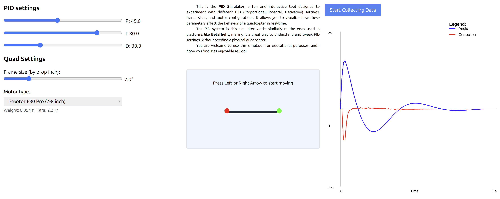

# PID Simulator

This is the **PID Simulator**, a fun and interactive tool designed to experiment with different PID (Proportional, Integral, Derivative) settings, frame sizes, and motor configurations. It allows you to visualize how these parameters affect the behavior of a quadcopter in real-time.

The PID system in this simulator works similarly to the ones used in platforms like **Betaflight**, making it a great way to understand and tweak PID settings without needing a physical quadcopter.

You are welcome to use this simulator for educational purposes, and I hope you find it as enjoyable as I do!

## Features
- Adjust **P**, **I**, and **D** values using intuitive sliders.
- Experiment with various **frame sizes** and **motor presets**.
- Visualize the quadcopter's response to your settings in real-time.
- See how corrections are applied to maintain stability.

## Purpose
This project was created just for fun and to provide a hands-on way to learn about PID tuning and quadcopter dynamics. Whether you're a beginner or an experienced pilot, this simulator offers a safe and engaging way to explore PID concepts.

## How to Use
1. Adjust the PID sliders to change the quadcopter's behavior.
2. Select different motor types and frame sizes to see their impact.
3. Use the arrow keys to start moving the quadcopter and observe the corrections applied.

## Screenshot

## Getting Started
Follow the instructions below to run the simulator locally or deploy it online.

# Getting Started with Create React App

This project was bootstrapped with [Create React App](https://github.com/facebook/create-react-app).

## Available Scripts

In the project directory, you can run:

### `npm start`

Runs the app in the development mode.\
Open [http://localhost:3000](http://localhost:3000) to view it in the browser.

The page will reload if you make edits.\
You will also see any lint errors in the console.

### `npm test`

Launches the test runner in the interactive watch mode.\
See the section about [running tests](https://facebook.github.io/create-react-app/docs/running-tests) for more information.

### `npm run build`

Builds the app for production to the `build` folder.\
It correctly bundles React in production mode and optimizes the build for the best performance.

The build is minified and the filenames include the hashes.\
Your app is ready to be deployed!

See the section about [deployment](https://facebook.github.io/create-react-app/docs/deployment) for more information.

### `npm run eject`

**Note: this is a one-way operation. Once you `eject`, you can’t go back!**

If you aren’t satisfied with the build tool and configuration choices, you can `eject` at any time. This command will remove the single build dependency from your project.

Instead, it will copy all the configuration files and the transitive dependencies (webpack, Babel, ESLint, etc) right into your project so you have full control over them. All of the commands except `eject` will still work, but they will point to the copied scripts so you can tweak them. At this point you’re on your own.

You don’t have to ever use `eject`. The curated feature set is suitable for small and middle deployments, and you shouldn’t feel obligated to use this feature. However we understand that this tool wouldn’t be useful if you couldn’t customize it when you are ready for it.

## Learn More

You can learn more in the [Create React App documentation](https://facebook.github.io/create-react-app/docs/getting-started).

To learn React, check out the [React documentation](https://reactjs.org/).
